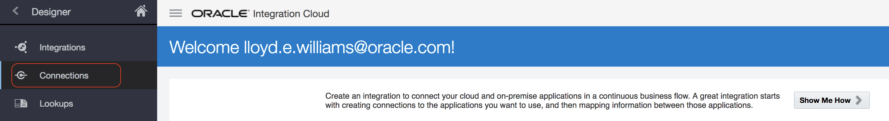
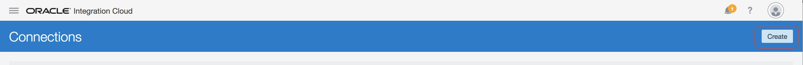

This tutorial explains how to use the REST adapter to allow a user to make a REST call using JSON to trigger an integration.

From the designer menu, choose **Connections**:

Click on the Create button to start creating a new connection:

Search for REST

Select the **REST** adapter.

Name the connection: **Local REST <your initials>** as shown in the picture below:

Click the **Create** button

